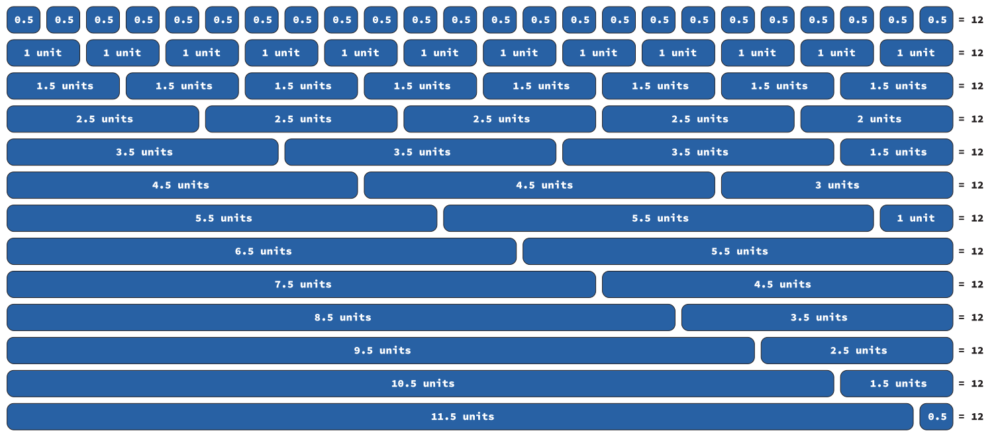
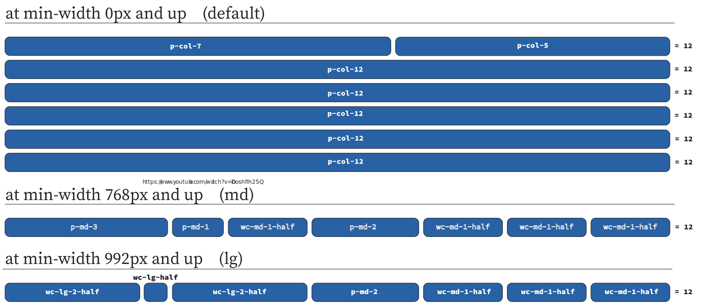

# General

## Overview

The Blue Oval Theme includes a collection of style and fonts to enhance the site's accessibility compliance, as well as accommodate usability patterns. This collection of styles and fonts is collectively known as webcore. The styles also come with a collection of
utility classes to be used to easily control the display, text and grid
using CSS classes. The source files are created using Sass. The syntax
that is used within the framework is SCSS
(<u>https://sass-lang.com/documentation/syntax</u>).

## Naming Convention

The utility classes provided within webcore are prefixed `wc-` which
stands for `webcore` so that one can identify which framework the classes
come from.

# Layout

## Overview

The responsive utilities are based on the utility classes that Bootstrap
(a CSS framework) uses. You can reference their documentation
(<u>https://getbootstrap.com/docs/4.5/utilities/display/</u>)
for a greater understanding of the purpose of utility classes and when
to use. Here we will outline the specific classes found within webcore,
the naming convention and some examples on how to use them.

## Responsive Breakpoints

Webcore is developed to be mobile first so we use media queries to
create responsive breakpoints for the layouts within a FRF application.
These breakpoints are based on minimum viewport widths. There are 5
breakpoints extra small (`xs`), small (`sm`), medium (`md`), large (`lg`), and
extra large (`xl`). The variables and assigned values for these
breakpoints are:

```scss
$breakpoint-xs: 480px !default;
$breakpoint-sm: 576px !default;
$breakpoint-md: 768px !default;
$breakpoint-lg: 992px !default;
$breakpoint-xl: 1200px !default;
```

Webcore uses these variables and they are available for use within your
applications source SCSS files as well. Below is an example of how to
use the media queries with the breakpoint variables within your source
SCSS files included in the framework.

```scss
// Extra extra small devices (portrait phones, less than 480px)
// No media query for &lt; 480px since this is the default in webcore

// Extra Small devices (portrait phones, 480px and up)
@media (min-width: $breakpoint-xs) { ... /* Add CSS rules here */ }

// Small devices (landscape phones, 576px and up)
@media (min-width: $breakpoint-sm) { ... /* Add CSS rules here */ }

// Medium devices (tablets, 768px and up)
@media (min-width: $breakpoint-md) { ... /* Add CSS rules here */ }

// Large devices (desktops, 992px and up)
@media (min-width: $breakpoint-lg) { ... /* Add CSS rules here */ }

// Extra large devices (large desktops, 1200px and up)
@media (min-width: $breakpoint-xl) { ... /* Add CSS rules here */ }
```

## Grid System

PrimeNG comes with a Grid Layout called Flex Grid
(<u><https://www.primefaces.org/primeng/v8.2.6-lts/#/flexgrid></u>) which is
built using flexbox and also uses similar breakpoints to webcore.
However they do not support the `xs` breakpoint. That breakpoint only
exists within webcore. So we’ve added some classes to extend what
PrimeNG offers to support the `xs` breakpoint. We also added intermediate
column widths to allow having what would be equivalent to a 24 column
grid while maintaining the standard 12 unit total column count.

### 12 Column Grid using Half Widths

Webcore includes a 12 column based extension grid where the smallest
column width is half (0.5 unit) of the width of the smallest Flex Grid
column width (1 unit). Since the webcore columns widths are a half unit,
they are named with a suffix of `-half`. The webcore half columns can be
used in combination with the Flex Grid columns. Thus creating a 24
column grid while maintaining the max unit count of a row to equal 12
units.

The classes are named using the format:

-   `.wc-col-half` this is the smallest column unit

-   `.wc-col-{number}-half` where number is between `1-11`

#### Usage

To calculate the total units of a row, add the half units with
the whole units and the total should be &lt;= 12 units.



#### Responsive

To use responsive columns, apply the breakpoint abbreviation to the
class name.

-   `.wc-{breakpoint}-half` for `xs`, `sm`, `md`, `lg`, and `xl`

-   `.wc-{breakpoint}-{number}-half` for `xs`, `sm`, `md`, `lg`, and `xl`

### Examples

This example comes from the List Bookings page in JAB.
(<u><https://github.ford.com/WaMCOE/frf-jab/blob/master/src/app/booking/list-bookings/list-bookings.component.html></u>)

Here you see the PrimeNG classes mixed with the Webcore utility classes.



```html
<tr class="p-grid wc-d-none wc-d-md-flex">
	<th class="p-col-7 p-md-3 wc-lg-2-half">Actions</th>
	<th class="p-col-5 p-md-1 wc-lg-half p-col-order-first p-md-order-0">
		<p-tableHeaderCheckbox></p-tableHeaderCheckbox>
	</th>
	<th class="p-col-12 wc-md-1-half wc-lg-2-half" [pSortableColumn]="cols[0].field">
		{{cols[0].header}}<p-sortIcon [field]="cols[0].field"></p-sortIcon>
	</th>
	<th class="p-col-12 p-md-2" [pSortableColumn]="cols[1].field">
		{{cols[1].header}}<p-sortIcon [field]="cols[1].field"></p-sortIcon>
	</th>
	<th class="p-col-12 wc-md-1-half" *ngFor="let col of columns | slice:2" [pSortableColumn]="col.field">
		{{col.header}}<p-sortIcon [field]="col.field"></p-sortIcon>
	</th>
</tr>
```

The table row is hidden by default. At the `md` breakpoint it is visible and displays as flex.

The table headers in the 1<sup>st</sup> and 2<sup>nd</sup> columns will be 7 and 5 units respectively and show in one row by default. The 2<sup>nd</sup> column will show as the first column by default. At the `md` breakpoint the 1<sup>st</sup> column will be width 3 units and the 2<sup>nd</sup> column will be 1 unit. The 2<sup>nd</sup> column becomes the second column again. At the `lg` breakpoint, the 1<sup>st</sup> column will be width 2.5 units and the 2<sup>nd</sup> column will be 0.5 unit wide.

The table header in the 3<sup>rd</sup> column will be full width (show on a line by itself) by default. At the `md` breakpoint, the column will be 2.5 units wide. At the `lg` breakpoint, the column will be width 2.5 units.

The table header in the 4<sup>th</sup> column will be full width (show on a line by itself) by default. At the `md` breakpoint the columns will be 2 units wide.

The table headers in the 5<sup>th</sup>, 6<sup>th</sup> and 7<sup>th</sup> columns will be full width (show on a line by itself) by default. At the `md` breakpoint the columns will be 1.5 units wide.

## Display

You can change the value of
the [<u>display property</u>](https://developer.mozilla.org/en-US/docs/Web/CSS/display) with
our responsive display utility classes. Classes can be combined for
various effects needed.

The following display values are supported:

-   `none`

-   `inline`

-   `inline-block`

-   `block`

-   `flex`

-   `inline-flex`

-   `table`

-   `table-row`

-   `table-cell`

The classes are named using the format:

-   `.wc-d-{value}` for default

-   `.wc-d-{breakpoint}-{value}` for `xs`, `sm`, `md`, `lg`, and `xl`

### Examples

```html
<div class="wc-d-inline">Displayed as inline.</div>
<div class="wc-d-flex">Displayed as a flexbox container.</div>
<div class="wc-d-block wc-d-lg-inline">Inline for larger screens and block for others.</div>
<div class="wc-d-md-none">Visible on a Small Screen</div>
<div class="wc-d-none wc-d-md-inline-flex">Hidden on a Small Screen</div>
<div class="wc-d-none p-print-block">Only visible when printed.</div>
<div class="wc-d-block p-print-none">Not available for printing.</div>
```
